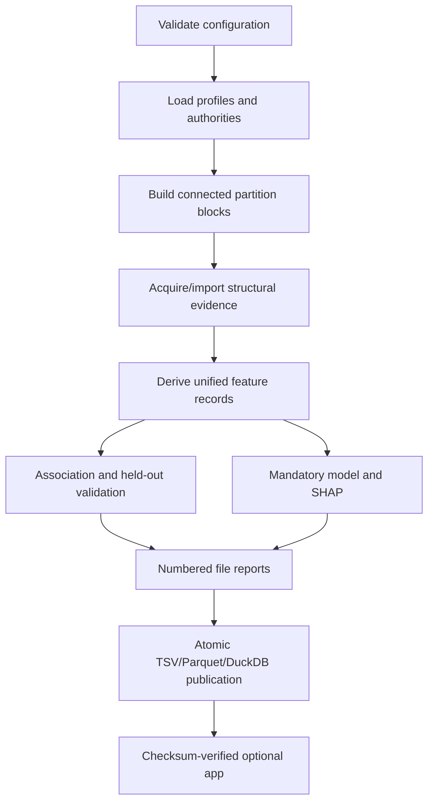

# Architecture

## Scope

The package is a deterministic analysis engine plus a read-only presentation layer. It
starts from explicit scientific authorities, derives comparable protein-level evidence,
tests that evidence by named class, runs a separate explainable classifier, and publishes
one portable result.

It does not own OrthoFinder execution, taxonomy reconciliation, de-novo AlphaFold inference,
Pfam scanning or the predecessor E3 ligandability pipeline.

## Component map

| Component | Responsibility |
|---|---|
| `config`, `starter`, `profiles` | Validate campaign policy, input paths, class hierarchy and comparisons |
| `fasta`, `tables`, `catalogue` | Strict FASTA/TSV authorities and conservative catalogue preparation |
| `orthofinder`, `orthofinder_resource` | Read raw layouts tested with OrthoFinder 2.5.5/3 or a checksum-complete published precursor resource |
| `redundancy`, `partitions` | Build connected independence blocks and freeze discovery/validation |
| `alphafold`, `foldseek`, `structural_resource` | Acquire or import structural evidence with tool/checksum provenance |
| `sequence_signatures`, `structural_signatures` | Derive exact k-mer, fold, availability and leakage-safe structure-cluster features |
| `associations`, `statistics` | Fisher exact tests, Wilson intervals, two FDR levels and held-out synthesis |
| `explainable_ml` | Group-aware elastic-net modelling, permutation importance and native SHAP graphics |
| `reporting`, `exports` | Numbered TSV/XLSX reports and deterministic PNG/SVG/PDF figures |
| `schemas`, `publication` | Typed tables, physical DuckDB, portable assets and atomic manifests |
| `protein_signature_app` | Verified read-only exploration; no scientific recomputation |

## Execution order



No output directory becomes visible as a completed result until every canonical table,
numbered TSV/XLSX report, PNG/SVG/PDF figure, database and asset has been written to staging
and checksummed. The final operation is a same-filesystem rename.

## Scientific authorities

The FASTA identifier is the primary protein key. Every optional table must resolve to that
exact key. The package never guesses by trimming isoforms, replacing underscores or taking
the newest file in a directory.

The selected OrthoFinder group has a four-part identity:

```text
(run_id, group_type, hierarchy_node, group_id)
```

`legacy_orthogroup_id` and `gene_tree_parent_clade` remain context fields and are not
silently substituted for that identity.

## Evidence normalisation

All positive evidence becomes a `FeatureRecord` with a stable `(feature_type, feature_id)`.
The same feature relation drives both the association engine and the model, while the source
tables preserve richer coordinates and provenance.

Technical availability features are published and tested by the association engine because
availability bias itself is scientifically informative. They are excluded from the default
classifier so the model cannot “recognise” a class merely because its structures were more
often generated.

## Leakage controls

OrthoFinder groups, exact-sequence clusters and supplied near-redundancy clusters form an
undirected graph. Its connected components are indivisible partition blocks. The stable
hash of each block and campaign seed determines discovery or validation allocation.

The structural graph has an additional constraint: only discovery-to-discovery passing
edges define components. Validation proteins can be projected to a frozen component through
a discovery edge, but cannot create or merge components.

Model feature selection, hyperparameter selection and fitting use discovery only. Group
identities are passed to every cross-validation fold. Held-out labels are used only for final
metrics and permutation importance.

## Extension points

- Add a protein-type profile as YAML; no Python E3 conditionals are required.
- Add a feature producer by writing the generic assessment/provenance TSV contract; only
  fixed-external or correctly discovery-derived definitions enter confirmatory inference.
- Add a native feature layer by returning `FeatureRecord` instances and preserving source
  detail in a typed table.
- Add a new completed-resource adapter without introducing an import-time dependency on the
  precursor package.
- Add app views by querying canonical DuckDB tables read-only.

New feature types are independent FDR families. Renaming a type therefore changes the
multiple-testing design and must be treated as a scientific schema change.

## Error and status policy

Malformed authorities, unsafe paths, checksum mismatches, conflicting identifiers and
failed required tools raise typed errors and stop publication. Scientific sparsity instead
produces an explicit status such as `INSUFFICIENT_SAMPLE_SIZE`, `INPUT_UNAVAILABLE` or
`NO_ELIGIBLE_FEATURES`. `NO_SIGNIFICANT_SIGNATURE` is reserved for a completed discovery
screen in which no tested feature passes the configured FDR threshold.

An eligible classifier failing SHAP or plot publication is fatal: SHAP is required for every
fitted model. A comparison that is not eligible still produces a complete model-status row
and no misleading plot.

## Versioning

- Package code uses semantic release versions.
- Profile versions change independently and are embedded in metadata.
- Input, model and coordinate content is identified by SHA-256.
- External tool versions and effective parameters enter cache provenance.
- Output schema version 1 is represented by the Arrow schemas in `schemas.py`.
